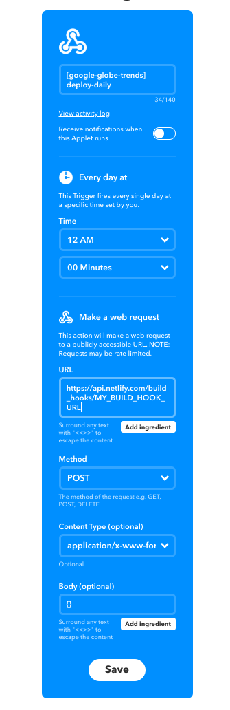

# 🌎 Google Globe Trends

Create beautiful and interactive Google Trends globe visualizations with ease.

## Overview


`google-globe-trends` is a [JAMStack][jamstack] application that visualizes Google Trends with an interactive React + ThreeJS globe. Data is fetched during build time using the [`google-trends-api`][google-trends-api] package. Globe visualizations are rendered using the [`react-globe`][react-globe-github] package.

This project is inspired by the wonderful [#metoorising][metoorising] project. With most interactive features supported by `react-globe`, the project aims to simplify building beautiful globe visualizations with Google Trends datasets.

## Deploy an Instance

### Deploy with Netlify

To deploy your personal Google Globe Trends instance, click on the **Deploy to Netlify** button below. You will be prompted to connect this instance to a Github repo. Follow through the steps and you should be able to view a working example with your own Netlify URL!

[](https://app.netlify.com/start/deploy?repository=https://github.com/chrisrzhou/google-globe-trends)

### Configurations

To configure your instance, you should clone the Github repo and test locally:

```sh
git clone git@github.com:MY_USER_NAME/MY_GOOGLE_GLOBE_TRENDS_INSTANCE.git

cd MY_GOOGLE_GLOBE_TRENDS_INSTANCE
npm install && npm start
```

You can configure the globe visuals (e.g. globe texture, glow color, zoom behaviors) by editing the [`config.js`](./src/config.js) file. For more resources on how to configure these options, please refer to the `react-globe` [docs][react-globe-docs].

If you would like to render the Google Trends of another keyword, simply change the `data.keyword` field of the config file. To apply changes to the data, run the `npm run build:data` command.

You should now be able to test your changes locally with the `npm start` command. If they look good, you can commit the changes to your Github repo, and Netlify will redeploy the instance with these updates automatically!

## Automate Data Updates

A really cool thing about Netlify is the ability to use build hooks. This provides you with a unique URL that you can use to trigger rebuilding the site. You can find this in the **Build Hooks** section for your Netlify project (e.g. https://app.netlify.com/sites/MY_GOOGLE_GLOBE_TRENDS_INSTANCE/settings/deploys). Go ahead and create a build hook and give it a meaningful name (e.g. `'daily-deploy'`).

You can now ping this build hook URL to rebuild the site. Services such as [IFTTT][ifttt] or [Zapier][zapier] provide simple ways to automate and schedule simple jobs that you can use to hit the build hook URL. Below is an example of setting up an IFTTT applet that is scheduled to hit the build hook URL every midnight.




## Author's Notes

Google Globe Trends is primarily meant to be an artistic and UI-focused experience to explore visualizing Google Trends data with an interactive React/ThreeJS globe. As a personal project, I wanted to learn how to abstract features and visual experiences in the [metoorising][metoorising] project into modular components. I also wanted to explore JAMStack techniques of automating and scheduling data updates at build time with IFTTT and web hooks. This project will probably not be actively updated but can serve as a template for other projects to draw ideas from!

<!-- Links -->
[jamstack]: https://jamstack.org/
[google-trends-api]: https://www.npmjs.com/package/google-trends-api
[react-globe-github]: https://github.com/chrisrzhou/react-globe
[react-globe-docs]: https://react-globe.netlify.com/
[metoorising]: https://metoorising.withgoogle.com/
[ifttt]: https://ifttt.com
[zapier]: https://zapier.com
